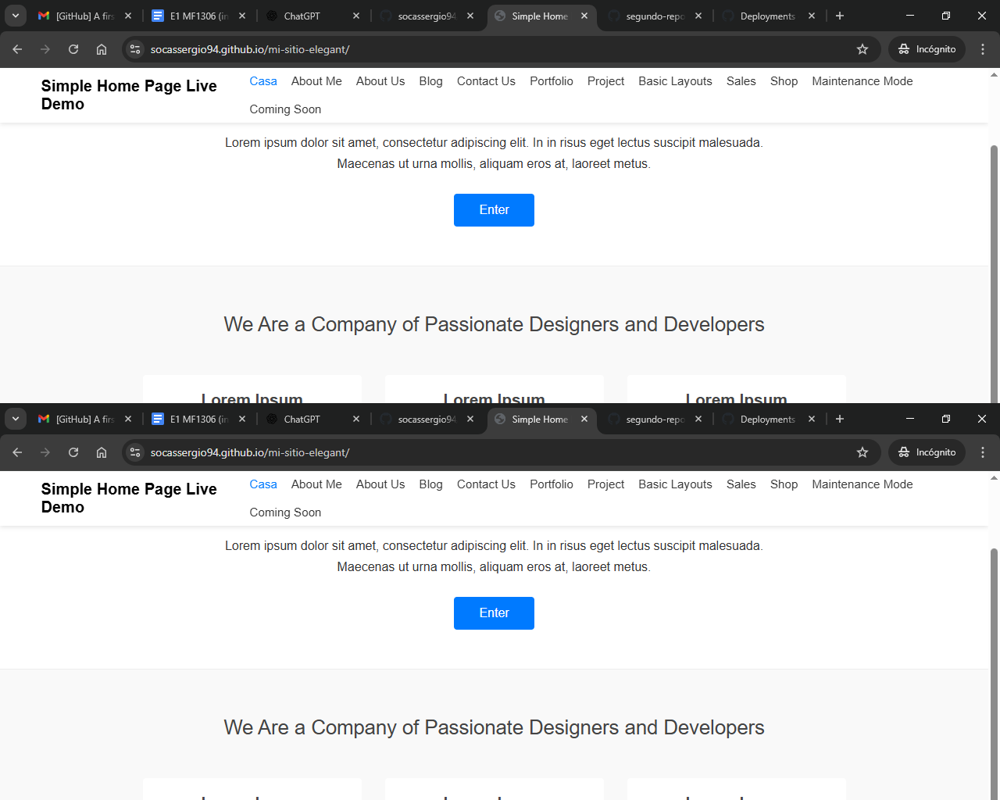

# 🌐 Mi sitio Elegant - Clon de layout

Este es un proyecto de maquetación web replicando (sin copiar) el layout [Simple Home Page](https://www.elegantthemes.com/layouts/simple/simple-home-page) de Elegant Themes.

## 🎯 Objetivo

Replicar fielmente el diseño seleccionado usando HTML5 y CSS3, aplicando buenas prácticas y control de versiones con Git.

## 🧪 Tecnologías

- HTML5 semántico
- CSS3 con Flexbox y Grid
- Google Fonts
- Git y GitHub
- GitHub Pages para despliegue

## 🗂️ Estructura del proyecto

mi-sitio-elegant/
├── index.html
├── css/
│ └── style.css
├── img/
├── docs/
│ └── captura.png
├── .gitignore
└── README.md

## 📸 Captura del sitio

# Prueba-practica-
